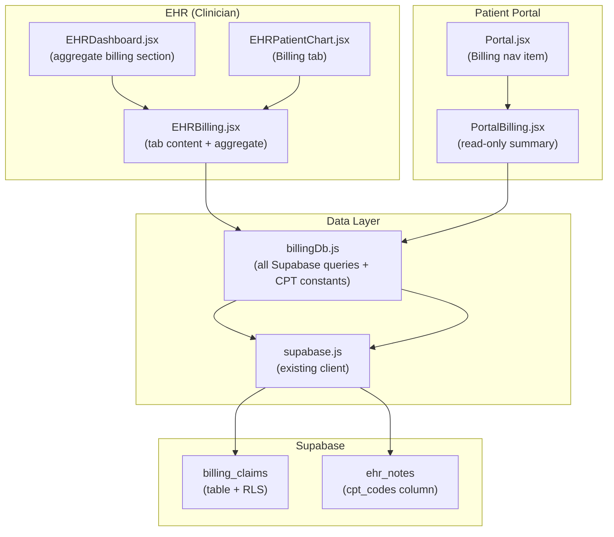

# Design Document: Billing & Claims (Phase 5)

## Overview

This document describes the technical design for the billing and claims module (Phase 5) of the MindShift Wellness Clinic web application. The feature adds a full billing lifecycle — CPT code attachment, insurance claim creation and status tracking, session-level financials, and patient balance computation — on top of the existing React 19 + Vite + Supabase stack.

Clinicians interact with billing through a new "Billing" tab in `EHRPatientChart` and an aggregate section in `EHRDashboard`. Patients get a read-only billing summary via a new "Billing" nav item in `Portal`. All data lives in a single new Supabase table (`billing_claims`) with RLS. No external payment processor is in scope.

### Key Design Decisions

- **Single table**: `billing_claims` holds all claim and session-billing data. No separate `session_billing` table is needed because each claim represents exactly one encounter.
- **Cents-as-integers**: All monetary values are stored as `integer` (cents) to avoid floating-point errors. A `formatCents` utility handles display formatting.
- **JSONB for CPT codes**: `cpt_codes` is a `jsonb` column storing `[{code, description}]`. This avoids a separate join table while keeping codes queryable.
- **RLS over application-layer auth**: Security is enforced at the database level via Supabase RLS policies, not just in the React layer.
- **billingDb.js as the single data access layer**: All Supabase queries go through `src/lib/billingDb.js`, consistent with the existing `ehrDb.js` / `portalDb.js` pattern.

---

## Architecture



### Data Flow

1. **Clinician creates a claim**: `EHRBilling` → `billingDb.createClaim()` → `billing_claims` INSERT (RLS: clinician role required).
2. **Clinician updates status**: `EHRBilling` → `billingDb.updateClaim()` → `billing_claims` UPDATE; `submitted_at` / `paid_at` set server-side via trigger or client-side in `billingDb`.
3. **Patient views billing**: `PortalBilling` → `billingDb.getMyBilling()` → `billing_claims` SELECT (RLS: `patient_id = auth.uid()`).
4. **CPT codes on notes**: `NoteForm` in `EHRPatientChart` → `billingDb.CPT_CODES` constant for the picker; codes saved to `ehr_notes.cpt_codes` via existing `upsertNote`.

---

## Components and Interfaces

### `src/lib/billingDb.js`

The sole data-access module for billing. Exports:

```js
// Constants
export const CPT_CODES = [
  { code: "90791", description: "Psychiatric diagnostic evaluation" },
  { code: "90792", description: "Psychiatric diagnostic evaluation with medical services" },
  { code: "90832", description: "Psychotherapy, 30 min" },
  { code: "90834", description: "Psychotherapy, 45 min" },
  { code: "90837", description: "Psychotherapy, 60 min" },
  { code: "90847", description: "Family psychotherapy with patient present" },
  { code: "90853", description: "Group psychotherapy" },
  { code: "99213", description: "Office visit, established patient, low complexity" },
  { code: "99214", description: "Office visit, established patient, moderate complexity" },
  { code: "99215", description: "Office visit, established patient, high complexity" },
];

// Utility
export function formatCents(cents: number): string  // "$120.00"
export function parseDollars(str: string): number   // "120.00" → 12000
export function filterCptCodes(query: string): CptCode[]
export function computePatientBalance(claims: Claim[]): number
export function validateFinancials(claim: Partial<Claim>): string | null

// Clinician queries (full CRUD)
export async function getClaims(patientId)
export async function getAggregateClaims({ statusFilter, limit })
export async function createClaim(payload)
export async function updateClaim(id, patch)
export async function deleteClaim(id)

// Patient query (read-only, RLS enforced)
export async function getMyBilling(patientId)
```

**`computePatientBalance(claims)`**: Pure function. Filters claims where `claim_status !== 'paid'`, sums `patient_responsibility_cents - copay_collected_cents`.

**`validateFinancials(claim)`**: Pure function. Returns a warning string if `amount_paid_insurance_cents + patient_responsibility_cents > amount_billed_cents`, or if status is `paid` and both payment fields are zero. Returns `null` if valid.

**`filterCptCodes(query)`**: Pure function. Case-insensitive substring match on `code` or `description`.

### `src/components/ehr/EHRBilling.jsx`

Renders two distinct views depending on props:

- **`<EHRBilling patientId chartId />`** — per-patient billing tab (used by `EHRPatientChart`)
- **`<EHRBillingAggregate />`** — aggregate dashboard section (used by `EHRDashboard`)

Internal sub-components:
- `ClaimList` — table of claims with status badges, sorted by `service_date` desc
- `ClaimRow` — expandable row showing inline detail view
- `ClaimForm` — create/edit form with CPT picker, financial fields, status selector
- `BalanceSummary` — displays patient balance with conditional color styling
- `CptPicker` — multi-select picker backed by `CPT_CODES`, with search filter

Uses `EhrCard`, `EhrBtn`, `EhrBadge`, `EhrInput`, `EhrSelect` from `EHRUI.jsx`. Respects `--ehr-*` CSS variables.

### `src/components/portal/PortalBilling.jsx`

Read-only patient billing summary. Props: `{ userId, P }` (consistent with other portal pages).

Internal sub-components:
- `BalanceBanner` — prominent balance due notice when balance > 0
- `ClaimSummaryRow` — one row per claim: service date, CPT codes, amounts, status badge
- `DeniedClaimNotice` — inline message directing patient to contact clinic

Uses `Card`, `Badge`, `PageHeader`, `EmptyState`, `T` tokens from `PortalUI.jsx`.

### Integration Points

**`EHRPatientChart.jsx`** — add `{ id: "billing", label: "Billing", icon: "💰" }` to `TABS` array; add `tab === "billing"` branch rendering `<EHRBilling patientId={chart.patient_id} chartId={chart.id} clinician={clinician} />`.

**`EHRDashboard.jsx`** — add `<EHRBillingAggregate />` component below the stats grid.

**`Portal.jsx`** — add `{ id: "billing", icon: "💳", label: "Billing" }` to `NAV` array; add `{page === "billing" && <PortalBilling userId={user?.id} P={P} />}` to the pages section.

**`EHRPatientChart.jsx` NoteForm** — add `CptPicker` to the note form; persist selected codes to `form.cpt_codes`; pass through `upsertNote`.

---

## Data Models

### `billing_claims` Table

```sql
CREATE TABLE billing_claims (
  id                          uuid PRIMARY KEY DEFAULT gen_random_uuid(),
  patient_id                  uuid NOT NULL REFERENCES auth.users(id),
  chart_id                    uuid NOT NULL REFERENCES ehr_charts(id),
  appointment_id              uuid REFERENCES appointments(id),
  note_id                     uuid REFERENCES ehr_notes(id),
  cpt_codes                   jsonb NOT NULL DEFAULT '[]',
  claim_status                text NOT NULL DEFAULT 'draft'
                                CHECK (claim_status IN ('draft','submitted','accepted','denied','paid')),
  service_date                date NOT NULL,
  amount_billed_cents         integer NOT NULL DEFAULT 0,
  amount_paid_insurance_cents integer NOT NULL DEFAULT 0,
  patient_responsibility_cents integer NOT NULL DEFAULT 0,
  copay_collected_cents       integer NOT NULL DEFAULT 0,
  submitted_at                timestamptz,
  paid_at                     timestamptz,
  notes                       text,
  created_by                  uuid NOT NULL REFERENCES auth.users(id),
  created_at                  timestamptz NOT NULL DEFAULT now(),
  updated_at                  timestamptz NOT NULL DEFAULT now()
);
```

**Constraint**: `appointment_id IS NOT NULL OR note_id IS NOT NULL` enforced at the application layer in `billingDb.createClaim()` (Supabase check constraints on nullable OR conditions are awkward; application validation is cleaner here).

**Indexes**:
```sql
CREATE INDEX idx_billing_claims_patient_id ON billing_claims(patient_id);
CREATE INDEX idx_billing_claims_chart_id   ON billing_claims(chart_id);
CREATE INDEX idx_billing_claims_status     ON billing_claims(claim_status);
CREATE INDEX idx_billing_claims_service_date ON billing_claims(service_date DESC);
```

### `ehr_notes` — CPT codes column

The existing `ehr_notes` table gains a `cpt_codes jsonb` column (added in the migration):

```sql
ALTER TABLE ehr_notes ADD COLUMN IF NOT EXISTS cpt_codes jsonb DEFAULT '[]';
```

### TypeScript-style type reference (for documentation)

```ts
type CptCode = { code: string; description: string };

type ClaimStatus = "draft" | "submitted" | "accepted" | "denied" | "paid";

type BillingClaim = {
  id: string;
  patient_id: string;
  chart_id: string;
  appointment_id: string | null;
  note_id: string | null;
  cpt_codes: CptCode[];
  claim_status: ClaimStatus;
  service_date: string;           // ISO date "YYYY-MM-DD"
  amount_billed_cents: number;
  amount_paid_insurance_cents: number;
  patient_responsibility_cents: number;
  copay_collected_cents: number;
  submitted_at: string | null;
  paid_at: string | null;
  notes: string | null;
  created_by: string;
  created_at: string;
  updated_at: string;
};
```

### RLS Policies

```sql
ALTER TABLE billing_claims ENABLE ROW LEVEL SECURITY;

-- Clinicians: full access (identified by clinician_roles membership or admin email)
CREATE POLICY "clinicians_full_access" ON billing_claims
  FOR ALL
  USING (
    EXISTS (
      SELECT 1 FROM clinician_roles WHERE user_id = auth.uid()
    )
  );

-- Patients: read-only, own records only
CREATE POLICY "patients_read_own" ON billing_claims
  FOR SELECT
  USING (patient_id = auth.uid());
```

---

## Correctness Properties

*A property is a characteristic or behavior that should hold true across all valid executions of a system — essentially, a formal statement about what the system should do. Properties serve as the bridge between human-readable specifications and machine-verifiable correctness guarantees.*

### Property 1: CPT codes round-trip through note persistence

*For any* non-empty array of valid CPT code objects, saving a visit note with those codes and reading the note back should return an array containing the same codes.

**Validates: Requirements 1.2**

---

### Property 2: New claim pre-populates CPT codes from linked note

*For any* visit note with a non-empty `cpt_codes` array, creating a claim linked to that note should result in the claim's `cpt_codes` being equal to the note's `cpt_codes`.

**Validates: Requirements 1.5**

---

### Property 3: Newly created claims always have draft status

*For any* valid claim creation payload (with any combination of financial values, service date, CPT codes, and linked appointment/note), the resulting claim's `claim_status` should be `"draft"`.

**Validates: Requirements 2.2**

---

### Property 4: Status transitions set timestamps correctly

*For any* claim, transitioning `claim_status` to `"submitted"` should set `submitted_at` to a non-null timestamp, and transitioning to `"paid"` should set `paid_at` to a non-null timestamp. These timestamps should not be set for any other status transition.

**Validates: Requirements 2.4, 2.5**

---

### Property 5: Non-draft claims cannot be deleted

*For any* claim with `claim_status` in `{"submitted", "accepted", "denied", "paid"}`, calling `deleteClaim` should return an error and the claim should still exist in the database.

**Validates: Requirements 2.8**

---

### Property 6: Claims query is ordered by service date descending

*For any* collection of claims for a patient with varying `service_date` values, `getClaims(patientId)` should return them ordered such that each claim's `service_date` is greater than or equal to the next claim's `service_date`.

**Validates: Requirements 2.9**

---

### Property 7: Cents formatting round-trip

*For any* non-negative integer number of cents, `parseDollars(formatCents(n).replace('$',''))` should equal `n`. Equivalently, `formatCents` should produce a string matching the pattern `$\d+\.\d{2}`.

**Validates: Requirements 3.2, 3.3**

---

### Property 8: Financial over-allocation validation

*For any* three non-negative integers `billed`, `paid_insurance`, and `patient_responsibility` where `paid_insurance + patient_responsibility > billed`, `validateFinancials` should return a non-null warning string.

*For any* three non-negative integers where `paid_insurance + patient_responsibility <= billed`, `validateFinancials` should return `null` (no warning).

**Validates: Requirements 3.4**

---

### Property 9: Paid status requires non-zero payment

*For any* claim where `amount_paid_insurance_cents === 0` AND `copay_collected_cents === 0`, `validateFinancials` called with `claim_status: "paid"` should return a non-null error string.

**Validates: Requirements 3.6**

---

### Property 10: Patient balance computation

*For any* array of claim objects with varying statuses and financial values, `computePatientBalance(claims)` should equal the sum of `(patient_responsibility_cents - copay_collected_cents)` for all claims where `claim_status !== "paid"`.

**Validates: Requirements 4.1**

---

### Property 11: CPT code list completeness

*For each* required CPT code (`90791`, `90792`, `90832`, `90834`, `90837`, `90847`, `90853`, `99213`, `99214`, `99215`), `CPT_CODES` should contain an entry with that exact code and a non-empty description string.

**Validates: Requirements 8.1**

---

### Property 12: CPT code search filter correctness

*For any* query string `q` and the full `CPT_CODES` list, every item returned by `filterCptCodes(q)` should have either `code` or `description` containing `q` as a case-insensitive substring. No item that matches should be omitted.

**Validates: Requirements 8.2**

---

### Property 13: Selected CPT code renders both fields

*For any* CPT code object `{ code, description }`, the rendered selected-state chip should contain both the `code` string and the `description` string as visible text.

**Validates: Requirements 8.4**

---

**Property Reflection (redundancy check):**

- Properties 8 and 9 both call `validateFinancials` but test distinct conditions (over-allocation vs. paid-with-zero-payment). They are not redundant.
- Properties 3 and 5 both relate to claim lifecycle but test different invariants (creation default vs. deletion guard). Not redundant.
- Properties 4 (timestamp setting) and 3 (default status) are complementary, not redundant.
- All 13 properties provide unique validation value.

---

## Error Handling

### Client-Side Validation (in `billingDb.js` and component layer)

| Condition | Handling |
|---|---|
| `appointment_id` and `note_id` both null on create | `createClaim` returns `{ error: "A claim must be linked to an appointment or visit note." }` |
| `claim_status` not in valid enum | `updateClaim` returns `{ error: "Invalid claim status." }` |
| Delete non-draft claim | `deleteClaim` returns `{ error: "Only draft claims may be deleted." }` |
| `paid_insurance + patient_responsibility > billed` | `validateFinancials` returns warning string; UI shows warning but does not block save |
| Status `paid` with zero payment | `validateFinancials` returns error string; UI blocks save |
| Negative monetary values | Input components clamp to 0; `parseDollars` returns 0 for negative input |

### Supabase / Network Errors

All `billingDb` functions return `{ data, error }` objects (consistent with existing `ehrDb.js` pattern). Components check `error` and display an inline error message using `EhrCard` (EHR) or `Alert` (Portal). No unhandled promise rejections.

### RLS Denial

If a patient attempts a write operation (blocked by RLS), Supabase returns a `403`-equivalent error. `PortalBilling` is read-only by design; no write UI is rendered for patients, so this is a defense-in-depth layer only.

---

## Testing Strategy

### Unit Tests (example-based)

Focus on specific behaviors and edge cases:

- `formatCents(0)` → `"$0.00"`
- `formatCents(12050)` → `"$120.50"`
- `parseDollars("120.50")` → `12050`
- `computePatientBalance([])` → `0`
- `computePatientBalance` with a mix of paid and non-paid claims
- `validateFinancials` with equal amounts (no warning)
- `validateFinancials` with paid status and zero payment (error)
- `filterCptCodes("")` → full list
- `filterCptCodes("90837")` → single match
- `deleteClaim` on a draft claim succeeds
- `deleteClaim` on a submitted claim returns error

### Property-Based Tests

Use **fast-check** (JavaScript PBT library) with minimum **100 iterations** per property.

Each test is tagged with: `// Feature: billing-claims, Property N: <property text>`

Properties to implement as PBT:

| Property | Generator inputs | Assertion |
|---|---|---|
| P7: Cents formatting round-trip | `fc.integer({ min: 0, max: 10_000_000 })` | `parseDollars(formatCents(n).slice(1)) === n` |
| P8: Financial over-allocation | `fc.tuple(fc.nat(), fc.nat(), fc.nat())` filtered where sum > billed | `validateFinancials(...) !== null` |
| P8 (valid case) | same, filtered where sum <= billed | `validateFinancials(...) === null` |
| P9: Paid with zero payment | any claim payload with both payment fields = 0 | `validateFinancials({ ...claim, claim_status: "paid" }) !== null` |
| P10: Balance computation | `fc.array(fc.record({ claim_status, patient_responsibility_cents, copay_collected_cents }))` | sum matches manual calculation |
| P12: CPT filter correctness | `fc.string()` as query | all results contain query; no matching item omitted |

### Integration Tests

- Clinician auth: CRUD operations on `billing_claims` succeed
- Patient auth: SELECT returns only own claims; INSERT/UPDATE/DELETE rejected
- Unauthenticated: all operations denied
- `submitted_at` is set when status transitions to `"submitted"` (database-level)
- `paid_at` is set when status transitions to `"paid"` (database-level)

### Smoke Tests

- `billing_claims` table exists with all required columns and correct types
- RLS is enabled on `billing_claims`
- Migration file `supabase/migrations/billing_claims.sql` is valid SQL
- `ehr_notes.cpt_codes` column exists
