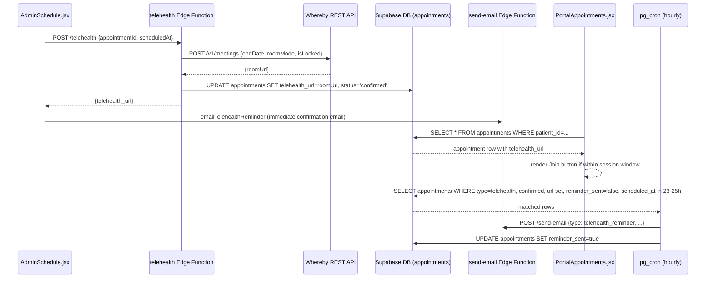

# Design Document — Telehealth Integration

## Overview

Phase 6 adds video telehealth sessions to MindShift Wellness Clinic's web app. When a clinician confirms a telehealth appointment, a Whereby video room is created via the Whereby REST API and the resulting URL is stored on the appointment row. Patients see a "Join Video Session" button in their portal during the session window. Clinicians access the same link from the Admin Schedule dashboard and from the EHR patient chart. A pg_cron job sends automated 24-hour reminder emails via the existing Resend/send-email Edge Function infrastructure.

The feature touches four layers:
1. **Database** — two new columns on `appointments`, pg_cron extension + job
2. **Edge Function** — new `telehealth` Supabase Edge Function (Whereby API proxy)
3. **Email** — new `telehealth_reminder` email type in `send-email` + `emailService.js` helper
4. **UI** — three existing components updated: `PortalAppointments.jsx`, `AdminSchedule.jsx`, `EHRPatientChart.jsx`

---

## Architecture



### Key Design Decisions

- **No Whereby SDK** — rooms are created via a plain `fetch` to `https://api.whereby.dev/v1/meetings`. The room URL is an opaque string stored in the DB; the frontend embeds it in an `<a target="_blank">` link rather than an iframe, keeping the implementation minimal.
- **Edge Function as proxy** — the `WHEREBY_API_KEY` secret never leaves the server. The frontend calls the `telehealth` Edge Function, which calls Whereby and writes the result to the DB directly using the Supabase service-role client.
- **Graceful degradation on Whereby failure** — if the Whereby API call fails, the appointment is still confirmed and `telehealth_url` remains null. The UI shows a "Generating link…" / "Video link coming soon" placeholder. This prevents a Whereby outage from blocking appointment confirmations.
- **pg_cron for reminders** — the 24-hour reminder runs as a database-level cron job rather than a separate service. It queries the DB directly and calls the existing `send-email` Edge Function via `http_post` (pg_net). The `reminder_sent` flag prevents duplicate sends.
- **Session window enforced client-side** — the 10-min-before / 60-min-after window is computed in the browser using the appointment's `scheduled_at` timestamp. No server-side enforcement is needed since the Whereby room itself expires 24 hours after creation.

---

## Components and Interfaces

### New: `supabase/functions/telehealth/index.ts`

Supabase Edge Function. Accepts a POST request from `AdminSchedule.jsx` when a telehealth appointment is confirmed.

**Request body:**
```json
{
  "appointmentId": "uuid",
  "scheduledAt": "2025-08-15T14:00:00Z",
  "patientEmail": "patient@example.com",
  "patientName": "Jane Doe"
}
```

**Behavior:**
1. Validate `WHEREBY_API_KEY` secret is present; return 500 if missing.
2. Call `POST https://api.whereby.dev/v1/meetings` with:
   - `endDate`: `scheduledAt + 24h` (ISO 8601)
   - `roomMode`: `"group"`
   - `isLocked`: `false`
3. On success: update `appointments` row — set `telehealth_url` and `status = 'confirmed'`.
4. On Whereby failure: update `appointments` row — set `status = 'confirmed'`, leave `telehealth_url` null. Log error.
5. Return `{ telehealth_url: string | null, status: "confirmed" }`.

**Response:**
```json
{ "telehealth_url": "https://whereby.com/mindshift-abc123", "status": "confirmed" }
```

**Headers:** Same CORS headers as `ai-proxy` and `send-email`.

**Secret:** `WHEREBY_API_KEY` — set via `supabase secrets set WHEREBY_API_KEY=...`

---

### Modified: `AdminSchedule.jsx` — `AppointmentsTab`

Changes to the `handleStatus` function and appointment card rendering:

- When `status === "confirmed"` and `appointment_type === "telehealth"`:
  1. Call the `telehealth` Edge Function instead of (or after) calling `updateAppointmentStatus` directly.
  2. After the Edge Function responds, call `emailTelehealthReminder` with the patient data and returned `telehealth_url`.
  3. Reload the appointments list.
- Appointment card rendering additions:
  - Show 📹 badge for any `appointment_type === "telehealth"` appointment.
  - If `telehealth_url` is set: show "📹 Join Video Session" button (opens in new tab).
  - If `telehealth_url` is null and status is `confirmed`: show "Generating link…" indicator.

---

### Modified: `PortalAppointments.jsx`

Changes to `DayDetail` and the list-view `Card` rendering:

- Appointment type options: add `"Telehealth (Video)"` to the `TYPES` array. On submit, normalize to `appointment_type: 'telehealth'`.
- For any appointment with `appointment_type === "telehealth"`: show 📹 badge.
- Session window logic (pure function, easily testable):
  ```js
  function sessionWindowState(scheduledAt, telehealthUrl) {
    if (!telehealthUrl) return "no_url";
    const now = Date.now();
    const start = new Date(scheduledAt).getTime() - 10 * 60 * 1000;
    const end   = new Date(scheduledAt).getTime() + 60 * 60 * 1000;
    if (now < start) return "before_window";
    if (now > end)   return "after_window";
    return "in_window";
  }
  ```
- Render based on state:
  - `"in_window"`: "📹 Join Video Session" button → `window.open(telehealthUrl, '_blank')`
  - `"before_window"`: "Session opens 10 min before your appointment" message
  - `"no_url"`: "Video link coming soon" placeholder
  - `"after_window"`: nothing (session ended)
- Both `DayDetail` and the list-view card use the same `sessionWindowState` helper.

---

### Modified: `EHRPatientChart.jsx` — `AppointmentsTab`

- For any appointment with `appointment_type === "telehealth"`: show 📹 badge.
- For appointments where `appointment_type === "telehealth"` AND `status === "confirmed"` AND `telehealth_url` is non-null: show "📹 Join Video Session" button → `window.open(telehealthUrl, '_blank')`.

---

### Modified: `send-email/index.ts`

Add a new `case "telehealth_reminder":` to the switch statement:

```ts
case "telehealth_reminder": {
  const { name, email, date, time, clinician, telehealth_url } = data;
  if (!email) break;
  await sendEmail(email, "Your Telehealth Session is Tomorrow — MindShift Wellness Clinic", base(`
    <span class="badge badge-purple">Telehealth Reminder</span>
    <h1>Your video session is tomorrow</h1>
    <p class="sub">Hi ${name}, here is your join link for tomorrow's telehealth appointment.</p>
    <table class="dt">
      <tr><td>📅 Date &amp; Time</td><td>${date} at ${time}</td></tr>
      <tr><td>👨‍⚕️ Clinician</td><td>${clinician}</td></tr>
      <tr><td>📍 Location</td><td>Telehealth (Video)</td></tr>
    </table>
    <a href="${telehealth_url}" class="btn">📹 Join Video Session</a>
    <div class="info">• Join from any device with a camera and microphone<br/>
    • The link opens 10 minutes before your appointment<br/>
    • Need to reschedule? Call <strong>(508) 306-1128</strong></div>
  `, "Telehealth reminder — MindShift Wellness Clinic."));
  break;
}
```

---

### Modified: `emailService.js`

Add one export:

```js
export const emailTelehealthReminder = (data) => send("telehealth_reminder", data);
```

---

## Data Models

### `appointments` table — new columns (migration)

```sql
ALTER TABLE appointments
  ADD COLUMN IF NOT EXISTS telehealth_url text,
  ADD COLUMN IF NOT EXISTS reminder_sent boolean NOT NULL DEFAULT false;
```

`telehealth_url` is nullable. `reminder_sent` defaults to false and is non-nullable.

### pg_cron job (migration)

```sql
-- Enable pg_cron extension
CREATE EXTENSION IF NOT EXISTS pg_cron;

-- Enable pg_net for HTTP calls from cron
CREATE EXTENSION IF NOT EXISTS pg_net;

-- Hourly reminder job
SELECT cron.schedule(
  'send-telehealth-reminders',
  '0 * * * *',
  $$
  SELECT net.http_post(
    url := 'https://dhuswldjuuhtxejnmfla.supabase.co/functions/v1/send-email',
    headers := '{"Content-Type":"application/json","Authorization":"Bearer <SERVICE_ROLE_KEY>"}'::jsonb,
    body := json_build_object(
      'type', 'telehealth_reminder',
      'data', json_build_object(
        'name',          a.name,
        'email',         a.email,
        'date',          to_char(a.scheduled_at AT TIME ZONE 'America/New_York', 'Day, Month DD, YYYY'),
        'time',          to_char(a.scheduled_at AT TIME ZONE 'America/New_York', 'HH12:MI AM'),
        'clinician',     COALESCE(a.provider_name, 'Your Clinician'),
        'telehealth_url', a.telehealth_url
      )
    )::text
  )
  FROM appointments a
  WHERE a.appointment_type = 'telehealth'
    AND a.status = 'confirmed'
    AND a.telehealth_url IS NOT NULL
    AND a.reminder_sent = false
    AND a.scheduled_at BETWEEN now() + interval '23 hours' AND now() + interval '25 hours';

  UPDATE appointments
  SET reminder_sent = true
  WHERE appointment_type = 'telehealth'
    AND status = 'confirmed'
    AND telehealth_url IS NOT NULL
    AND reminder_sent = false
    AND scheduled_at BETWEEN now() + interval '23 hours' AND now() + interval '25 hours';
  $$
);
```

### Whereby API — room creation payload

```json
{
  "endDate": "2025-08-16T14:00:00Z",
  "roomMode": "group",
  "isLocked": false
}
```

Response includes `roomUrl` (string) which is stored as `telehealth_url`.

### Session window computation

| State | Condition |
|---|---|
| `before_window` | `now < scheduled_at - 10min` |
| `in_window` | `scheduled_at - 10min ≤ now ≤ scheduled_at + 60min` |
| `after_window` | `now > scheduled_at + 60min` |

---

## Correctness Properties

*A property is a characteristic or behavior that should hold true across all valid executions of a system — essentially, a formal statement about what the system should do. Properties serve as the bridge between human-readable specifications and machine-verifiable correctness guarantees.*

### Property 1: Telehealth appointment type normalization

*For any* appointment request submitted with type "Telehealth (Video)", the stored `appointment_type` value SHALL equal `'telehealth'`.

**Validates: Requirements 1.2**

---

### Property 2: Telehealth URL round-trip preservation

*For any* valid Whereby room URL (including URLs with path segments, query parameters, and varying lengths), storing the URL in `telehealth_url` and retrieving it SHALL return the identical string without truncation or modification.

**Validates: Requirements 2.2**

---

### Property 3: Whereby API call conditionality

*For any* appointment confirmation, the Whereby REST API SHALL be called if and only if `appointment_type = 'telehealth'`. For any non-telehealth appointment type, the Whereby API SHALL never be called.

**Validates: Requirements 3.1, 3.4**

---

### Property 4: endDate is always 24 hours after scheduled_at

*For any* valid `scheduled_at` timestamp passed to the `telehealth` Edge Function, the `endDate` field sent to the Whereby API SHALL equal `scheduled_at + 24 hours` (expressed as an ISO 8601 string).

**Validates: Requirements 3.5**

---

### Property 5: Session window state is a total function of time and URL

*For any* confirmed telehealth appointment with a given `scheduled_at` and `telehealth_url`, the `sessionWindowState` function SHALL return exactly one of `"no_url"`, `"before_window"`, `"in_window"`, or `"after_window"`, and the patient portal SHALL render the correct UI element for that state (join button, pre-window message, or placeholder).

**Validates: Requirements 4.1, 4.3, 4.4**

---

### Property 6: Admin join button appears if and only if telehealth + URL present

*For any* appointment rendered in the Admin Schedule, the "Join Video Session" button SHALL appear if and only if `appointment_type = 'telehealth'` AND `telehealth_url` is non-null. For any appointment where either condition is false, the button SHALL NOT appear.

**Validates: Requirements 5.1, 5.4**

---

### Property 7: EHR join button appears if and only if telehealth + confirmed + URL present

*For any* appointment rendered in the EHR patient chart, the "Join Video Session" button SHALL appear if and only if `appointment_type = 'telehealth'` AND `status = 'confirmed'` AND `telehealth_url` is non-null.

**Validates: Requirements 6.1, 6.3**

---

### Property 8: Telehealth reminder email contains all required fields

*For any* telehealth reminder email rendered by the `send-email` Edge Function, the resulting HTML SHALL contain: (a) an `<a>` element whose `href` equals the `telehealth_url` value, (b) the appointment date string, (c) the appointment time string, and (d) the clinician name string.

**Validates: Requirements 7.2, 7.3**

---

### Property 9: emailTelehealthReminder is called on every telehealth confirmation

*For any* telehealth appointment confirmation in the Admin Schedule, `emailTelehealthReminder` SHALL be called exactly once with the patient's email, name, appointment date/time, clinician name, and the returned `telehealth_url`.

**Validates: Requirements 7.5**

---

### Property 10: Reminder cron job is idempotent — reminder_sent prevents duplicates

*For any* appointment that has already had `reminder_sent = true`, the pg_cron query SHALL NOT select it, ensuring the `send-email` Edge Function is called at most once per appointment for the 24-hour reminder.

**Validates: Requirements 7.8, 7.10**

---

### Property 11: WHEREBY_API_KEY never appears in any Edge Function response

*For any* request to the `telehealth` Edge Function (success, error, or missing-key scenarios), the response body SHALL NOT contain the value of the `WHEREBY_API_KEY` secret.

**Validates: Requirements 8.2**

---

### Property 12: Telehealth badge appears in all three views for any telehealth appointment

*For any* appointment with `appointment_type = 'telehealth'`, the 📹 video icon or "Telehealth" badge SHALL be rendered in the Patient Portal, Admin Schedule, and EHR patient chart appointment views.

**Validates: Requirements 9.1, 9.2, 9.3**

---

## Error Handling

| Scenario | Behavior |
|---|---|
| Whereby API returns non-2xx | Log error; set `status = 'confirmed'`, leave `telehealth_url = null`; return `{ telehealth_url: null, status: "confirmed" }` to client |
| `WHEREBY_API_KEY` secret missing | Return HTTP 500 `{ error: "WHEREBY_API_KEY is not configured" }` immediately |
| `telehealth_url` is null in portal | Show "Video link coming soon" placeholder; no join button |
| `telehealth_url` is null in admin | Show "Generating link…" indicator |
| pg_cron email call fails | Log via pg_net error; `reminder_sent` is NOT set to true (so the next hourly run retries) |
| Patient accesses join link after room expiry (>24h) | Whereby handles gracefully; room shows "ended" — outside our control |
| Non-telehealth appointment confirmed | No Whereby call; normal confirmation flow unchanged |

---

## Testing Strategy

This feature is well-suited for property-based testing on the pure logic layer (session window computation, email rendering, type normalization) and example-based tests for UI interactions and infrastructure checks.

**Property-based testing library:** [fast-check](https://github.com/dubzzz/fast-check) (JavaScript/TypeScript, works with Vitest)

### Unit / Property Tests

Each property test runs a minimum of 100 iterations via fast-check arbitraries.

**`sessionWindowState` (pure function):**
- Property 5: Generate random `scheduledAt` timestamps and `telehealthUrl` values; verify the returned state matches the expected time-based condition and the portal renders the correct element.
- Tag: `Feature: telehealth-integration, Property 5: session window state is a total function`

**Appointment type normalization:**
- Property 1: Generate appointment form submissions with type "Telehealth (Video)"; verify stored `appointment_type = 'telehealth'`.
- Tag: `Feature: telehealth-integration, Property 1: telehealth appointment type normalization`

**Email template rendering:**
- Property 8: Generate random `{ name, email, date, time, clinician, telehealth_url }` objects; call the `telehealth_reminder` template function; assert all four required fields appear in the HTML output.
- Tag: `Feature: telehealth-integration, Property 8: telehealth reminder email contains all required fields`

**URL round-trip:**
- Property 2: Generate random URL strings (varying length, path depth, query params); store and retrieve; assert equality.
- Tag: `Feature: telehealth-integration, Property 2: telehealth URL round-trip preservation`

**endDate calculation:**
- Property 4: Generate random ISO timestamps; compute `endDate`; assert it equals input + exactly 86400 seconds.
- Tag: `Feature: telehealth-integration, Property 4: endDate is always 24 hours after scheduled_at`

**Join button conditionality (admin + EHR):**
- Properties 6 & 7: Generate random appointment objects with varying `appointment_type`, `status`, and `telehealth_url`; render the component; assert button presence matches the expected condition.
- Tags: `Feature: telehealth-integration, Property 6` and `Property 7`

**Reminder cron idempotency:**
- Property 10: Generate sets of appointments with varying `reminder_sent`, `status`, `appointment_type`, `telehealth_url`, and `scheduled_at`; run the filter query; assert only appointments matching all criteria are selected, and none with `reminder_sent = true`.
- Tag: `Feature: telehealth-integration, Property 10: reminder cron job is idempotent`

**Whereby API call conditionality:**
- Property 3: Generate random appointment types; mock the Whereby API; assert it is called iff `appointment_type = 'telehealth'`.
- Tag: `Feature: telehealth-integration, Property 3: Whereby API call conditionality`

**API key not leaked:**
- Property 11: Generate various request scenarios; assert response body does not contain the API key string.
- Tag: `Feature: telehealth-integration, Property 11: WHEREBY_API_KEY never appears in response`

**Telehealth badge in all views:**
- Property 12: Generate random appointments; render each view component; assert badge presence matches `appointment_type = 'telehealth'`.
- Tag: `Feature: telehealth-integration, Property 12: telehealth badge in all three views`

### Example-Based Unit Tests

- Clicking "Join Video Session" calls `window.open(url, '_blank')` (portal, admin, EHR)
- Admin schedule renders "Generating link…" when `telehealth_url` is null on a confirmed telehealth appointment
- Whereby room creation payload includes `roomMode: "group"` and `isLocked: false`
- Auth rejection: Edge Function returns 401 when no Authorization header is provided

### Smoke Tests (Infrastructure)

- `telehealth_url` column exists and is nullable on `appointments` table
- `reminder_sent` column exists with `NOT NULL DEFAULT false`
- `pg_cron` extension is enabled
- `"send-telehealth-reminders"` cron job exists with schedule `'0 * * * *'`
- `emailTelehealthReminder` is exported from `emailService.js`
- `send-email` Edge Function returns 200 for `type: "telehealth_reminder"` with valid data
- Edge Function returns HTTP 500 when `WHEREBY_API_KEY` is not set
